<!-- author: dinhan -->
# Quản lý vé xem phim
Đồ án môn Lập trình hướng đối tượng sử dụng Java Swing + MySQL + Mô Hình MVC
## Getting Started

1. Tải source code về:

   ```bash
   git clone https://github.com/githubcuaan/Cinema_ProjectOOP_nhom8.git
   ```
2. Import cơ sở dữ liệu trong folder database trong source code.

3. Sử dụng netbeans để chạy source code.

### Tài khoản ADMIN
- Tài khoản: thuyduong
- Mật khẩu: thuyduong

### Giao diện
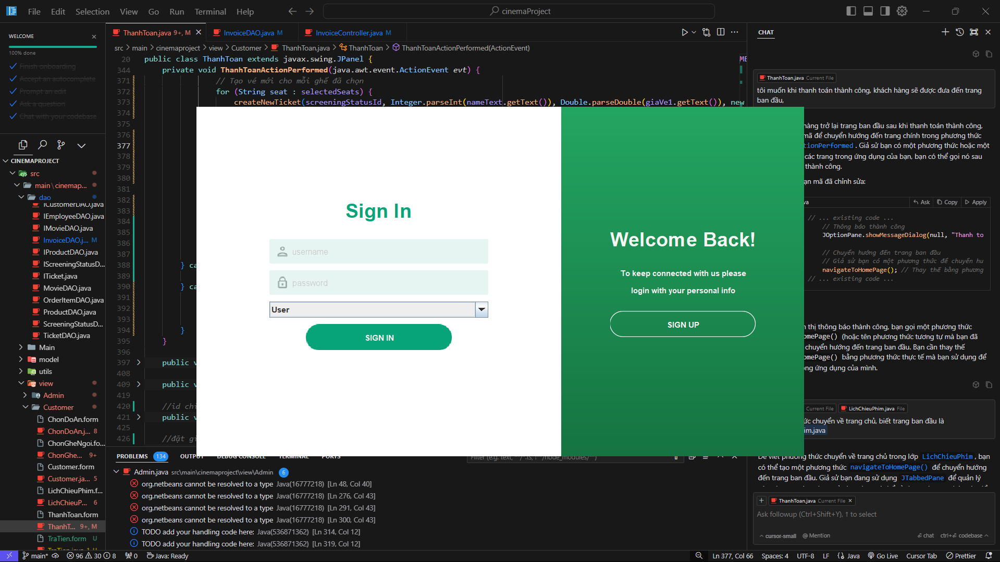
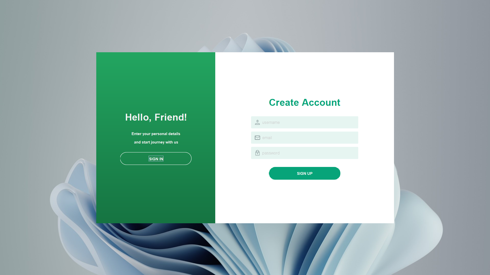
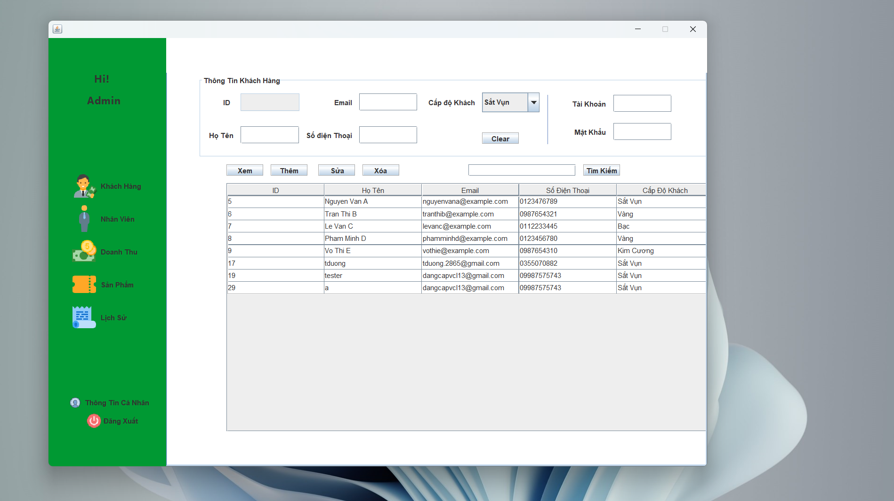
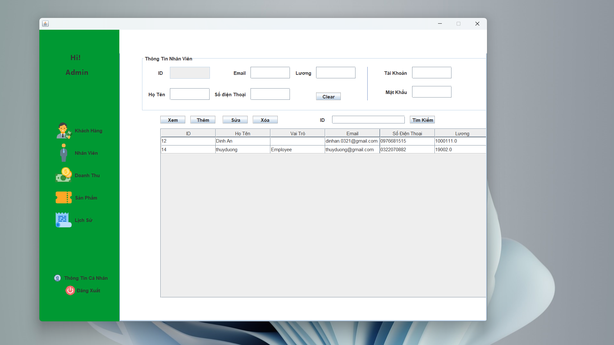
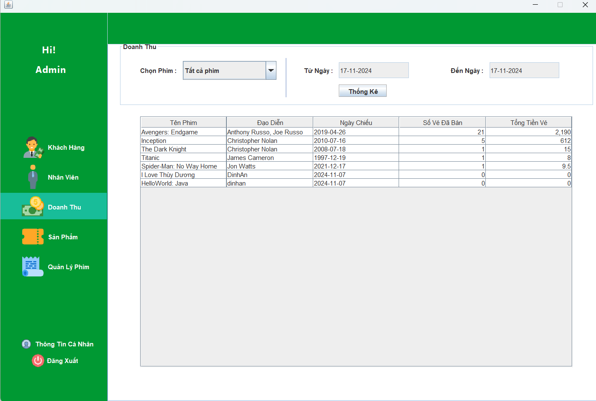
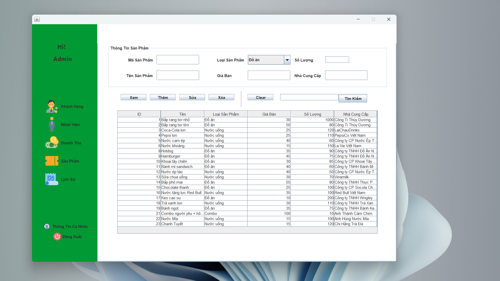
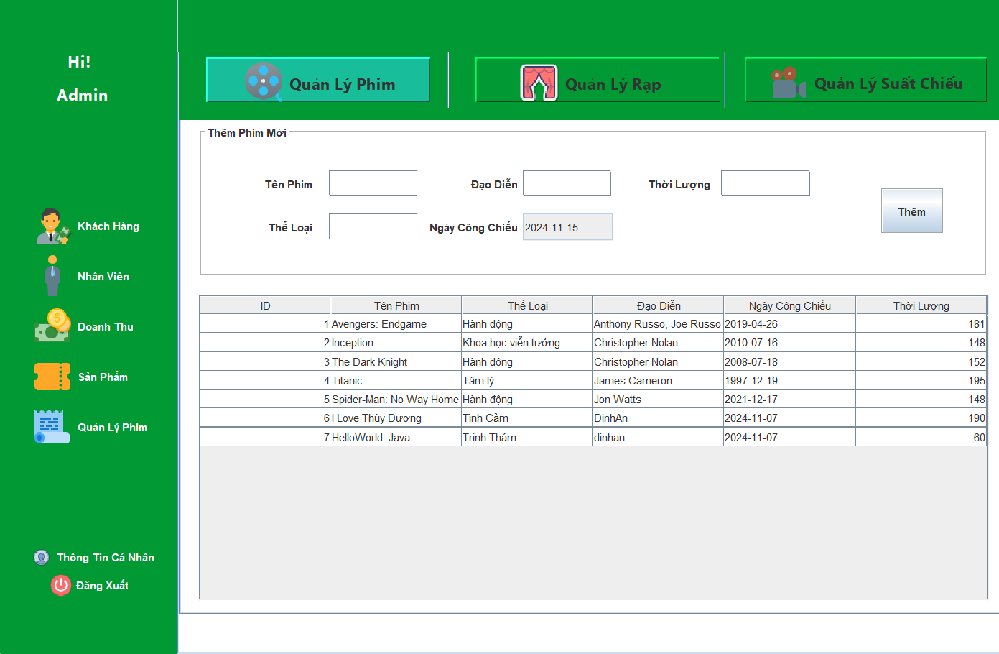
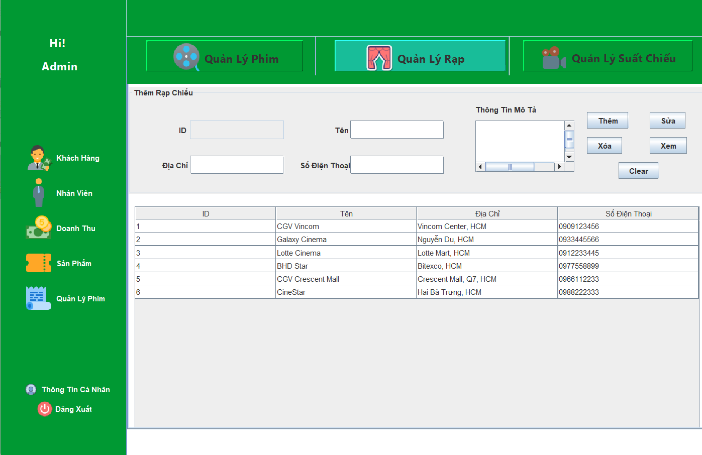
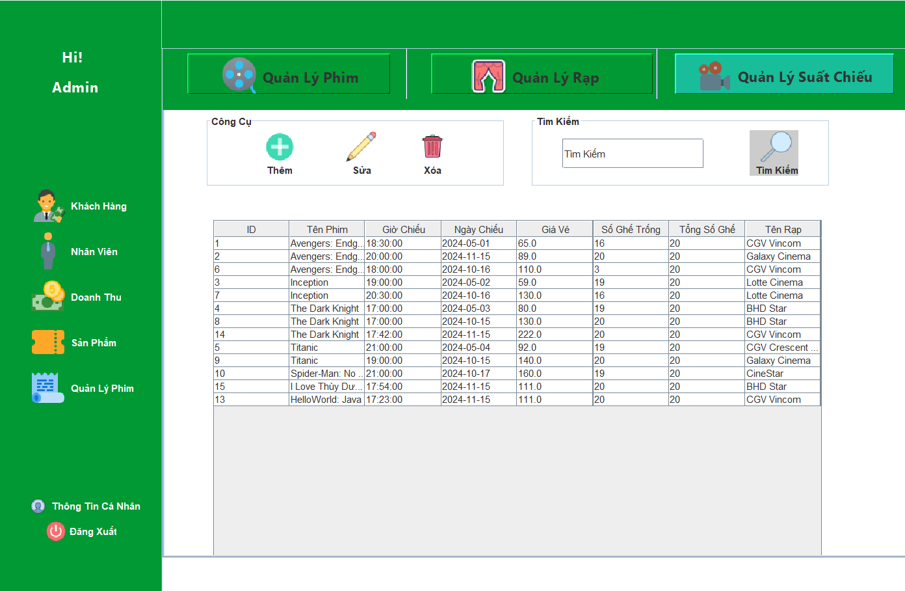
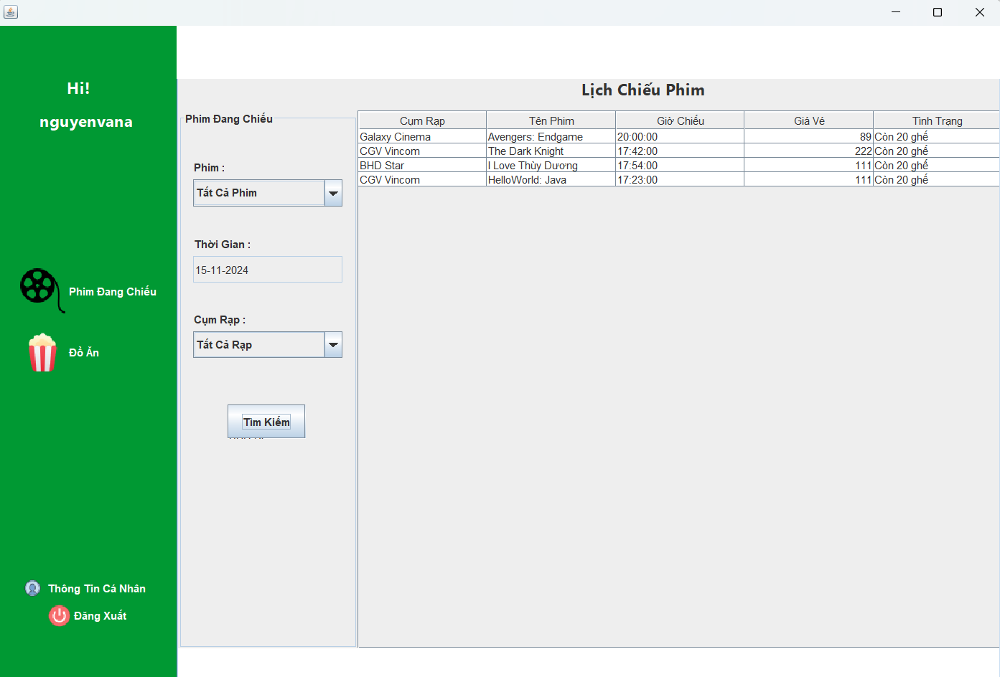
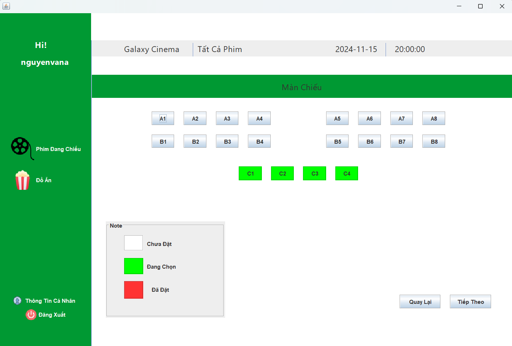
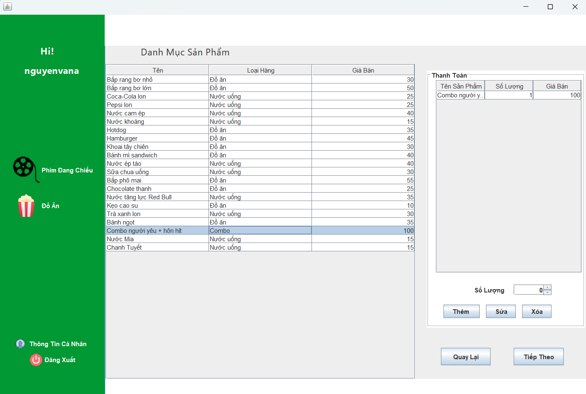
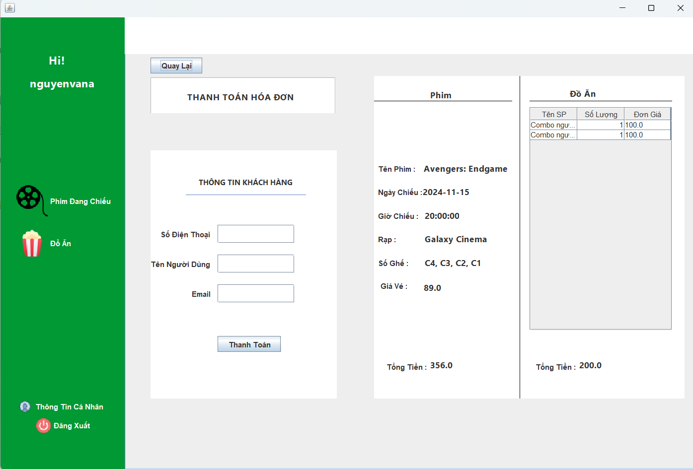
